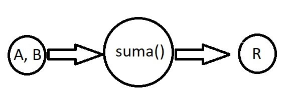

# Adicion

## Objetivo
_Completar todas las etapas de la resolucion de problemas para un problema simple: la adicion de dos numeros_

## Temas
* Resolucion de problemas
* Entrada de datos
* Tipos numéricos
* Adición
* Léxico
* Representacion de algoritmos

## Resolucion
_Se creo un archivo **adicion.cpp** el cual realizará la operacion mediante el llamado a la funcion **suma()**_

_La funcion **suma()** le pedira al usuario que ingrese los valores a sumar, para luego mostrale el resultado por consola_

_Finalmente la funcion main le preguntará al usuario si quiere seguir realizando sumas o no_

## Herramientas empleadas
* Editor de tecto **Visual Studio Code**
* Compilador **MinGW**
* **CMD** de Windows

### Implementacion
_Desde el **CMD** posicionarse dentro de la carpeta del proyecto_

_Compilar el **adicion.cpp** y crear como salida el ejecutable **adicion.exe**_
```
g++ adicion.cpp -o adicion.exe
```

_Ejecutar **adicion.exe**_


### Modelo IPO


