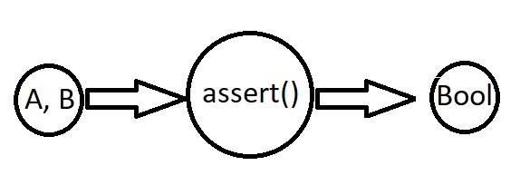

# Adicion

## Objetivo
_Mediante un ejemplo, demostrar la aplicacion de tipos de datos: **bool, char, unsigned, int, double, y string**_

## Temas
* Tipos de datos
* Declaraciones
* Variables
* Valores

## Restricciones
_No extraer valores de **cin**, usar valores literales (constantes)_

### Crédito extra
* ¿Son esos realmente todos los tipos de datos vistos en clase? Justificar.
* No utilizar **cout**, y si utilizar **assert** para las pruebas.

## Resolucion
_Se creo un archivo **EjemploTipos.cpp** en el cual se realizan varias pruebas de operaciones con distintos tipos de variables y valores_

_Las pruebas se realizaron mediante el uso de **assert** el cual analiza una condicion, que de cumplirse dejara que el programa proceda, de lo contrario lo interrupirá
indicando donde se produjo el problema_

_Se agregó un **system("pause()")** al final del programa para que al finalizar, este se detenga esperando que se presione una tecla cualquiera. De esta manera
sepodra visualizar mas facilmente si se produjo algun error (acusado por los assert) o si el programa finalizo correctamente_

## Herramientas empleadas
* Editor de texto **Visual Studio Code**
* Compilador **MinGW**
* **CMD** de Windows

### Implementacion
_Desde el **CMD** posicionarse dentro de la carpeta del proyecto_

_Compilar el **EjemploTipos.cpp** y crear como salida el ejecutable **Ejemplotipos.exe**_
```
g++ EjemploTipos.cpp -o Ejemplotipos.exe
```

_Ejecutar **tipos.exe**_


### Modelo IPO


