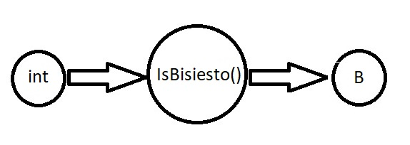
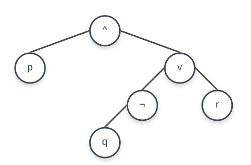

* Logica de la funcion
IsBisiesto: N --> B / p ^ (¬q v r)


# Bisiesto

## Objetivo
_Demostrar el usod e operadores booleanos y expresiones complejas_

## Temas
* Expresiones
* Operadores booleanos: **and, or, y not**
* Operador resto: **%**
* Asociatividad de operadores: **ID o DI**
* Precedencia de operadores
* Orden de evaluacion de operandos
* Efecto de ladod e una expresión

## Problema
_Dado un año determinar si es bisiesto_

## Hipotesis
_Debe ser un año divisible por **4** _
_**NO** deb ser divisible por **100**, excepto por **400**_
_Debe ser posterior a **1582**_

## Restricciones
* Desarrollar la logica de una funcion
* El nombre de la funcion deve ser **IsBisiesto**
* Aplicar operadores booleanos
* No aplicar el operador condicional
* No aplicar **if** ni **switch**

### Logica de la función
```
IsBisiesto: N --> B / p ^ (¬q v r)
```

## Resolucion
_Se creo un archivo **IsBisiesto.cpp** en el cual se realizan varias pruebas con distintos años mediante **assert**_

_Cada assert le pasará el año que se desea verifiar a la funcion **IsBisiesto()**_

_Se agregó un **system("pause()")** al final del programa para que al finalizar, este se detenga esperando que se presione una tecla cualquiera. De esta manera
sepodra visualizar mas facilmente si se produjo algun error (acusado por los assert) o si el programa finalizo correctamente_

## Herramientas empleadas
* Editor de texto **Visual Studio Code**
* Compilador **MinGW**
* **CMD** de Windows

### Implementacion
_Desde el **CMD** posicionarse dentro de la carpeta del proyecto_

_Compilar el **IsBisiesto.cpp** y crear como salida el ejecutable **IsBisiesto.exe**_
```
g++ IsBisiesto.cpp -o IsBisiesto.exe
```

_Ejecutar **IsBisiesto.exe**_


### Modelo IPO



### Arbol de expresión
